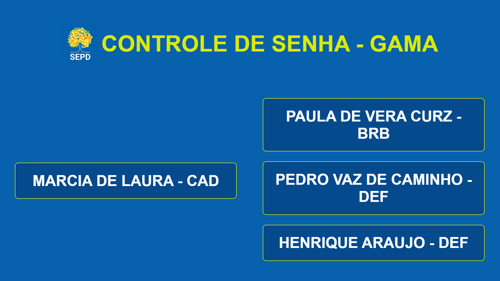

# Gerador de Senha
Projeto feito na SEPD

[](https://github.com/henriquearaujooficial/Chamador-de-Senhas/blob/main/LICENSE)

# 🛠️ Projeto construído usando:
```bash
- HTML
- CSS
- JS
```

# Gerador de Senhas e suas descrições:

Uma descrição do que cada parte do código faz:

Passo a Passo de Funcionamento do Sistema de Controle de Senhas para Guichês
## 1. Inicialização do Sistema
O sistema inicia com as variáveis de senhaAtual e ultimaSenha definidas como null e 0, respectivamente.
Os guichês são mapeados e atribuídos aos números de 1 a 6, conforme configurado no código.
## 2. Exibição da Interface
A interface gráfica é carregada com as seguintes informações:
Número do Guichê: Exibido ao lado da palavra "GUICHÊ".
Número da Senha Atual: Exibido ao lado da palavra "SENHA".
Última Senha Chamada: Exibida na parte inferior.
## 3. Atribuição dos Guichês
Os guichês são mapeados conforme o número da senha:
O guichê é determinado usando a fórmula Math.ceil(senhaAtual / 10). Por exemplo, senhas de 1 a 10 são atendidas pelo Guichê 1, senhas de 11 a 20 pelo Guichê 2, e assim por diante.
Cada guichê possui um status (liberado ou ocupado), que é verificado a cada chamada de senha.
## 4. Chamada de Senha
Quando a tecla ArrowRight (Seta Direita) é pressionada:
Incremento da Senha: O sistema incrementa o valor de senhaAtual.
Verificação do Guichê: O sistema verifica se o guichê atribuído à nova senha está "ocupado".
Se ocupado, o sistema procura o próximo guichê "liberado".
Se todos os guichês estão ocupados, o sistema alerta o usuário que não há guichês disponíveis e não atualiza a senha.
Atualização do Display: O sistema atualiza o número da senha atual, a última senha chamada e o guichê correspondente na tela.
Áudio: Um áudio é reproduzido para notificar a chamada de senha.
## 5. Forçar Chamada de Guichê Específico
Quando a tecla g é pressionada:
O sistema solicita ao operador que digite o número de um guichê específico (entre 1 e 6).
O sistema atualiza o display para esse guichê, e a senha é incrementada normalmente.
## 6. Resetar Senhas
Quando a tecla r é pressionada:
O sistema redefine as variáveis de senhaAtual e ultimaSenha para seus valores iniciais (null e 0).
O display é atualizado para refletir o reset (senha "0000" e guichê "01").
## 7. Finalização de Atendimento
Ao concluir um atendimento, o status do guichê correspondente é definido como "liberado", pronto para receber uma nova senha.
Resumo do Fluxo
Inicialização do Sistema → Configuração dos guichês e valores iniciais das senhas.
Interface de Exibição → Interface responsiva com informações de senha e guichê.
Chamada de Senha → Incremento de senha e verificação de guichê disponível.
Forçar Chamada de Guichê → Chamada manual para um guichê específico.
Resetar Senhas → Reinicialização dos valores das senhas e guichês.
Finalização de Atendimento → Liberar o guichê para novo atendimento.



